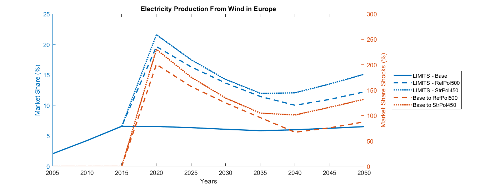
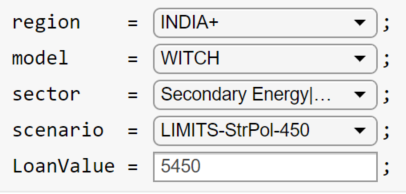
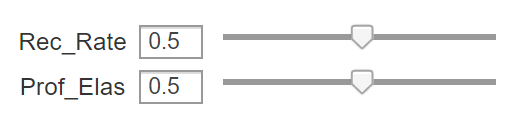

# Acknowledgements

We’d like to thank **Stefano Battiston, Antoine Mandel and Irene Monasterolo** for their help in developing and validating this example. The three scholars are amongst the authors of the referenced papers, rank among the leaders in global climate impact research, and are pioneers in the assessment of climate-related financial risks. They are also founders of [**CLIMAFIN**](https://climafin.com/), a start-up that provides solutions climate-related financial risk for corporate clients.

# A climate stress-test methodology for loan portfolios

Table of Contents

- [Introduction](#Introduction)
- [Methodology](#Methodology)
- [Data](#Data)
- [Market Share shock calculation](#Market-Share-shock-calculation)
  * [Coal in Africa](#Coal-in-Africa)
  * [Wind in Europe](#Wind-in-Europe)
  * [Application to any Region and Model](#Application-to-any-Region-and-Model)
- [Results](#Results)
- [References](#References)

# Introduction

This section illustrates an example of calculation of climate financial risk, focusing on energy infrastructure loans, extracted from [**Monasterolo et al. 2018**](#ref1). The work demonstrates how one can calculate climate policy shocks based on forward-looking trajectories of market shares of energy sectors, by type of technology in fossil fuels and renewable energy, derived by Integrated Assessment Models (IAMs). It then shows how to assess the order of magnitude of changes in value of each bank’s loan, conditional upon a climate policy shock. The analysis is applied to Chinese development banks’ energy infrastructure loans.

This work is part of a broader stream of research on climate mitigation scenarios and financial risk, discussed in the 2021 Science article by [**Battiston et al. 2021**](#ref2). In particular, it can be applied to the climate scenarios of orderly and disorderly transition developed by the Network for Greening the Financial System [**NGFS 2020**](#ref4).

The approach of connecting IAM scenarios to financial shocks was first introduced in [**Battiston et al. 2017**](#ref1) which developed the general framework to compute: (i) shocks on the value of financial assets (equity holdings, bonds and loans), (ii) financial risk metrics, such as the Climate Value at Risk, and (iii) direct and indirect losses for portfolios of individual financial institutions. This approach can be used for Climate Stress test exercises where indirect losses are computed based on financial network models. This framework has been applied to supervisory data, covering bank loans and investment funds’ holdings in [**Roncoroni et al. 2021**](#ref5) in collaboration with the Central Bank of Mexico.


# Methodology


The methodology of Monasterolo et al. 2018, considers a financial actor, *i*, with a portfolio of investments through contract loans to distinct borrowers, with a valuation model including three time steps: the time at which the valuation is carried out (), the time at which a climate policy shock occurs (), and the maturity of the loan to borrower *j* (). Within this scenario, the authors define the following variables:


   \item{  : the financial valuation at time  of the investment of bank *i* in the project *j*, with maturity  }
   \item{  : the face value of the loan }
   -    : the probability at time  that the borrower, , defaults on the loan at the maturity  


The concept of a climate policy shock is then introduced as an occurrence at time  where the economy switches (e.g. driven by a change in agents’ expectations) from a business-as-usual scenario (B), characterized by no climate policy, to scenario P. In P, a climate policy is introduced aimed to reach a specific GHG emission target by 2100, and, as a result, market shares of some economic sectors are affected. It is assumed that this adjustment of the economy (and the expectations) modifies the probability of default of the borrower  through changes in the market share of the economic sector of   through changes in the market share of the economic sector of . Hence, a change in default probability implies a proportional change in the expected value of the loan as:


With the aim on defining this change in default probability, the authors assume that a relative change in the market share of borrower ’s sector  within the geographic region , denoted by , implies a proportional relative change in ’s profitability. Hence, by defining a market share shock as:


Under the assumption described in the article, the authors prove that the change in expected value of a loan, conditional to a change from scenario B to scenario P, reads as:


where

   -   : the initial equity level of the borrower 
   -    : the recovery rate for borrower  
   -    : the elasticity coefficient between profitability and market share 
   -    : width of the distribution of the idiosyncratic shocks 

For the sake of simplicity, it is further assumed that:

   -    Corresponding to the assumption that the magnitude of the initial net worth and width of the distribution of the idiosyncratic shocks are comparable.  
   -         This case corresponds to the upper bound of the loss incurred on a given loan.  
   -         This is a special case 

These parameters should be calibrated based on the specific application. Hence, the change in expected value of a loan reads as:


# Data

In order to calculate the market share shocks, one can use any of the available IAM models. As an example, using the NGFS database one can query the total net production of electricity in the World and the corresponding subsector corresponding to Coal.

```matlab:Code(Display)
c = iam.data.IIASAconnection('ngfs');
e = iam.IAMEnvironment(c);
ts = e.getTimeSeries('model',"GCAM5.3_NGFS",'regions',"World", 'Variables', ...
                     ["Secondary Energy|Electricity", "Secondary Energy|Electricity|Coal"], 'strict', true)
```
Similarly, the climate data for the article of this example was obtained using [**LIMITS database**](https://tntcat.iiasa.ac.at/LIMITSDB/dsd?Action=htmlpage&page=about) and then stored into a .MAT file for ease of use. The full database can be downloaded as a CSV file directly from [**the database main website**](https://tntcat.iiasa.ac.at/LIMITSPUBLICDB/dsd?Action=htmlpage&page=register1-3). The authors collected data from two models, (GCAM and WITCH) and three different scenarios (Base, RefPol500, StrPol450). In turn, each of this model-scenario pairs, contains data on 10 relevant regions and several variables.

```matlab:Code
format bank
c = iam.data.LIMITSconnection('./LIMITSPUBLIC_2014-10-13.csv');
```

```matlab:Code
e = iam.IAMEnvironment(c);

regions = ["AFRICA", "CHINA+", "EUROPE", "INDIA+", "LATIN_AM", "MIDDLE_EAST", "NORTH_AM", "PAC_OECD", "REF_ECON", "REST_ASIA"];
variables = ["Secondary Energy|Electricity", "Secondary Energy|Electricity|Coal", "Secondary Energy|Electricity|Wind", ...
    "Secondary Energy|Electricity|Oil", "Secondary Energy|Electricity|Gas", "Secondary Energy|Electricity|Nuclear", "Secondary Energy|Electricity|Hydro", ...
    "Secondary Energy|Electricity|Solar", "Primary Energy|Oil", "Primary Energy"];
scenarios = ["LIMITS-Base","LIMITS-RefPol-500","LIMITS-StrPol-450"];
GCAM = e.getTimeSeries('models','GCAM','scenarios',scenarios,'variables',variables,'regions', regions,'strict',true);
GCAM(1)
```

```text:Output
ans = 
  IAMTimeseries with properties:

       Model: "GCAM"
    Scenario: "LIMITS-Base"
    Variable: "Primary Energy"
      Region: "NORTH_AM"
        Unit: "EJ/yr"
       RunId: 0
     Version: 0
       Years: [15x1 double]
      Values: [15x1 timetable]

```

```matlab:Code
WITCH = e.getTimeSeries('models','WITCH','scenarios',scenarios,'variables',variables,'regions', regions,'strict',true);
WITCH(1)
```

```text:Output
ans = 
  IAMTimeseries with properties:

       Model: "WITCH"
    Scenario: "LIMITS-Base"
    Variable: "Primary Energy"
      Region: "NORTH_AM"
        Unit: "EJ/yr"
       RunId: 0
     Version: 0
       Years: [15x1 double]
      Values: [15x1 timetable]

```

```matlab:Code
models = [GCAM;WITCH];
```

The loan data used in the paper was obtained from the [**GEGI database**](http://www.bu.edu/cgef/#/2019/EnergySource) for the two main Chinese banks.

# Market Share shock calculation

To calculate the market share shock values, we first need to calculate the market share of each of the selected variables. Within the context of the scenario databases maintained by IIASA (including the NGFS scenarios), this implies calculating the percentage of each variable over its parent magnitudes. Following the article examples, we focus here on two regions: AFRICA and EUROPE, and two magnitudes: the net production of electricity from COAL and WIND.

## Coal in Africa

In this first example, we concentrate on the net production of electricity from Coal in Africa. This magnitude appears under the name of ***"Secondary Energy|Electricity|Coal"*** in the database. The market share shocks are therefore computed as the relation between this variable and the total net production of electricity in AFRICA:


```matlab:Code
sector = "Secondary Energy|Electricity|Coal";
baseSector = getUpperSector(sector)
```

```text:Output
baseSector = "Secondary Energy|Electricity"
```
To perform this calculation we simply need to extract the data corresponding to Africa:

```matlab:Code
Africa = WITCH([WITCH.Region] == "AFRICA");
CoalInAfrica = synchronize(Africa( [Africa.Variable] == sector).Values);
ElecInAfrica = synchronize(Africa( [Africa.Variable] == baseSector).Values);
msCoalAfrica = CoalInAfrica{:,:}./ElecInAfrica{:,:}*100;
```

This results in the following values for the three selected scenarios:

```matlab:Code
figure;
msC = plot(CoalInAfrica.Year, msCoalAfrica, 'LineWidth',2);
set(msC, {'LineStyle'}, {'-';'--';':'})
legend("LIMITS - Base", "LIMITS - RefPol500", "LIMITS - StrPol450",'Location','northwest');
xlim([datetime(2005,1,1), datetime(2050,1,1)])
ylabel('Market Share (%)')
xlabel('Year')
title('Net Electricity Production From Coal')
```


Knowing the market share, we can then compute the market share shocks as the difference arising from the transition from a business-as-usual scenario (B), characterized by no climate policy, to scenario P:


```matlab:Code
shocks = (msCoalAfrica(:,2:3) - msCoalAfrica(:,1))./msCoalAfrica(:,1)*100;
```

and if we plot them together, we obtain the market share shock corresponding to each point in time ()

```matlab:Code
fig1 = figure;
fig1.Position(3)=fig1.Position(3)*2;
axes('parent',fig1);
yyaxis left
plot(CoalInAfrica.Year, msCoalAfrica, 'LineWidth',2)
xlabel('Years');
ylabel('Market Share (%)')

yyaxis right
shp = plot(CoalInAfrica.Year, shocks, 'LineWidth',2);
set(shp, {'LineStyle'}, {'--';':'})
ylabel('Market Share Shocks (%)')

xlim([datetime(2005,1,1) datetime(2050,1,1)])
lg = legend("LIMITS - Base", "LIMITS - RefPol500", "LIMITS - StrPol450", "Base to RefPol500", "Base to StrPol450");
title("Electricity Production From Coal in Africa")
lg.Location = "eastoutside";
```


## Wind in Europe

In this second example, we concentrate on the net production of electricity from Wind in Europe. This magnitude appears under the name of **"Secondary Energy|Electricity|Wind"** in the LIMITS database. To determine the shocks coming from this magnitude, we first compute the market share of coal as:


```matlab:Code
Europe = WITCH([WITCH.Region] == "EUROPE");
sector = "Secondary Energy|Electricity|Wind";
baseSector = getUpperSector(sector);

WindInEurope = synchronize(Europe( [Europe.Variable] == sector).Values);
ElecInAfrica = synchronize(Europe( [Europe.Variable] == baseSector).Values);
msWindEurope = WindInEurope{:,:}./ElecInAfrica{:,:}*100;
```

As before, we can then plot these results and visualize the market share trends for the given variable:

```matlab:Code
figure;
msE = plot(WindInEurope.Year, msWindEurope, 'LineWidth',2);
set(msE, {'LineStyle'}, {'-';'--';':'})
legend("LIMITS - Base", "LIMITS - RefPol500", "LIMITS - StrPol450",'Location','best');
xlim([datetime(2005,1,1) datetime(2050,1,1)])
```


Knowing the market share, we can then compute the shocks as the difference arising from the transition from a base scenario to a specific set of policies, i.e.:


and if we plot them together we obtain:

```matlab:Code
fig = figure;
fig.Position(3) = fig.Position(3)*2;
ax = axes('Parent',fig);
yyaxis(ax,'left')
plot(WindInEurope.Year, msWindEurope, 'LineWidth',2)
xlabel('Years');
ylabel('Market Share (%)')
ylim([0 25])

yyaxis(ax,'right')
shocks = (msWindEurope(:,2:3) - msWindEurope(:,1))./msWindEurope(:,1)*100;
shp = plot(WindInEurope.Year, shocks, 'LineWidth',2);
set(shp, {'LineStyle'}, {'--';':'})
ylabel('Market Share Shocks (%)')

xlim(ax, [datetime(2005,1,1) datetime(2050,1,1)])
lg = legend("LIMITS - Base", "LIMITS - RefPol500", "LIMITS - StrPol450", "Base to RefPol500", "Base to StrPol450");
title("Electricity Production From Wind in Europe")
lg.Location = "eastoutside";
ylim([0 300])
```



## Application to any Region and Model

Note that while the two examples above are for specific regions and scenarios within the LIMITS database, this same analysis can be applied to other regions and IAM models available in the IIASA database. For example:

```matlab:Code
c = iam.data.IIASAconnection('ngfs');
e = iam.IAMEnvironment(c);
models_iiasa = e.Models.Name;
regions = e.Regions.Name;
model = models_iiasa(1); region = regions(97);

ts = e.getTimeSeries('model',model,'regions',region,'strict', true,'Variables', [ ...
    "Secondary Energy|Electricity", ...
    "Secondary Energy|Electricity|Coal", ...
    "Secondary Energy|Electricity|Oil", ...
    "Secondary Energy|Electricity|Gas", ...
    "Secondary Energy|Electricity|Wind", ...
    "Secondary Energy|Electricity|Biomass", ...
    "Secondary Energy|Electricity|Solar", ...
    "Secondary Energy|Electricity|Hydro", ...
    "Secondary Energy|Electricity|Nuclear", ...
    "Secondary Energy|Electricity|Geothermal"]);

runList = ts.getRunList;
```

Given the model and the region, it is then trivial to compute the market share and the resulting shocks for any target scenario. As an example, we can plot the market share for all Secondary energy variables in the GCAM 5.2 model at a given region.

```matlab:Code
AvailableScenarios = unique(runList.Scenario);
BaseScenario = AvailableScenarios(2); TargetScenario = AvailableScenarios(1);
```
Once we have the data, we can plot some of these variables to make sure that they look as expected.

```matlab:Code
scenarioIdx     = runList.Scenario == TargetScenario;
BaseScenarioIdx = runList.Scenario == BaseScenario;
mainSectorIdx   = runList.Variable == "Secondary Energy|Electricity";
plotMarketShare(ts, scenarioIdx, mainSectorIdx)
```


# Results

Once we have the market share shocks, we are in the position of computing the change in expected value of a loan. To match the results provided in the article, we have automated this process such that one can select a region, model, sector, scenario, and the calculator returns the expected value of a loan, given its Face Value 



The change in expected value of the loan which we automatically evaluate at 2030 to match the results provided in Tables 3-6 of the article:


```matlab:Code
idx = [models.Model] == model & [models.Region] == region & ([models.Scenario] == scenario | [models.Scenario] == 'LIMITS-Base') ;
baseSector = getUpperSector(sector);
shocks = computeShocks(models(idx), 'LIMITS-Base', scenario, baseSector, sector);
total = min(shocks.Shock,1)*LoanValue;
disp("Value at 2030 is: " + total(year(shocks.Time) == 2030))
```

```text:Output
Value at 2030 is: -3312.631
```

Finally, recall that we made the assumptions that

 = 1             
 = 1

which are easily incorporated into the model by defining a couple of constants:



that allow the users to evaluate the change in expected value using the extended model:


```matlab:Code
total = total*(1-r_j)*chi;
disp("Value adjusted at 2030 is: " + total(4))
```
```text:Output
Value adjusted at 2030 is: 116.4752
```

# References

<a name="ref1">[1]</a>: Battiston, S., Mandel, A., Monasterolo, I., Schütze, F., and Visentin, G., **A climate stress-test of the financial system**. *Nature Clim Change 7,*** **283–288 (2017). [https://doi.org/doi:10.1038/nclimate3255]
(https://doi.org/doi:10.1038/nclimate3255)

<a name="ref2">[2]</a>: Battiston, S., Monasterolo, I., Riahi, K., \& van Ruijven, B. (2021). **Climate mitigation pathways need to account for the ambivalent role of finance**. *Science*, 28 May 2021, 10.1126/science.abf3877. https://science.sciencemag.org/content/early/2021/05/19/science.abf3877

<a name="ref3">[3]</a>: Monasterolo, I., Zheng, Jiani I., and Battiston, S., **Climate Transition Risk and Development Finance: An Assessment of China's Overseas Energy Investments Portfolio**. *China and the World Economy*, *26*, *6*(116–142) (2018). [https://doi.org/10.1111/cwe.12264](https://doi.org/10.1111/cwe.12264)

<a name="ref4">[4]</a>: NGFS. (2020). NGFS - Network for Greening the Financial System - **Guide to climate scenario analysis for central banks and supervisors 2020**, https://www.ngfs.net/sites/default/files/medias/documents/ngfs_guide_scenario_analysis_final.pdfRoncoroni, A., Battiston, S. Escobar-Farfán, LOL., and Martinez-Jaramillo, S., **Climate risk and financial stability in the network of banks and investment funds**. *Journal of Financial Stability* 54 (2021): 100870. [https://doi.org/10.1016/j.jfs.2021.100870](https://doi.org/10.1016/j.jfs.2021.100870)

<a name="ref5">[5]</a>: Roncoroni, A., Battiston, S. Escobar-Farfán, LOL., and Martinez-Jaramillo, S., **Climate risk and financial stability in the network of banks and investment funds**. *Journal of Financial Stability* 54 (2021): 100870. [https://doi.org/10.1016/j.jfs.2021.100870](https://doi.org/10.1016/j.jfs.2021.100870)
