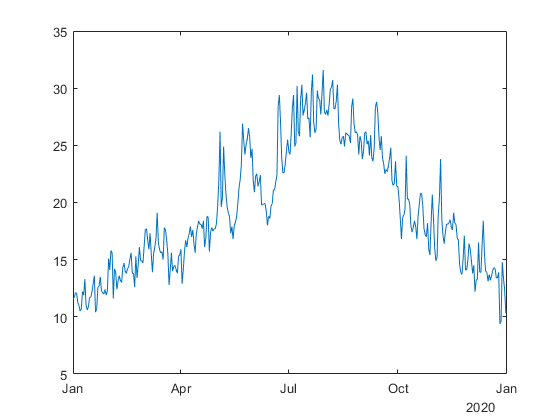
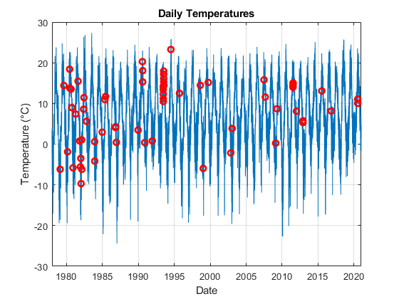
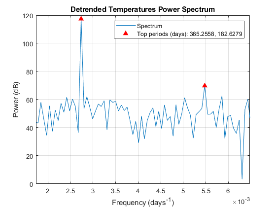
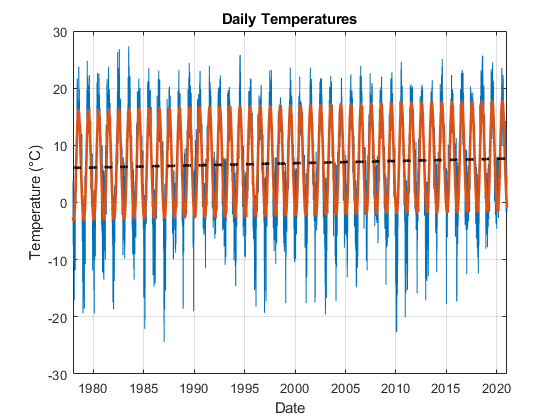
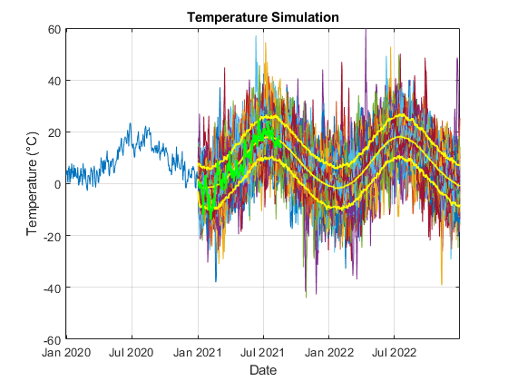
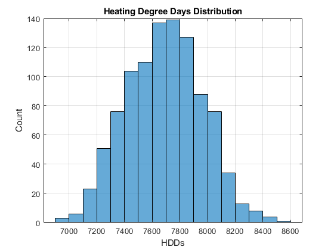
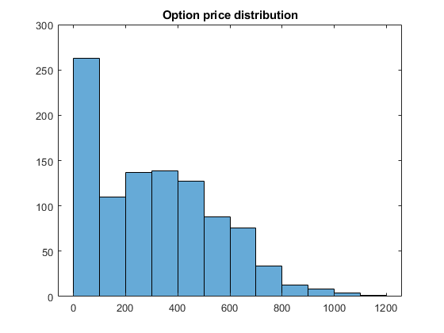

# Pricing Weather Derivatives


**Ken Deeley and Edu Benet Cerda, MathWorks**


This script demonstrates a workflow for pricing weather derivatives based on historical observed temperature data. The actual code can be found at:


[Climate-IAM-Explorer/examples at master · mathworks/Climate-IAM-Explorer (github.com)](https://github.com/mathworks/Climate-IAM-Explorer/tree/master/examples)


Topics include:


   -  Estimating deterministic trends in a time series 
   -  Analysis of seasonality 
   -  Creating and fitting ARIMA/GARCH models 
   -  Assessing the goodness-of-fit of a model 
   -  Performing Monte Carlo simulation from a model 
   -  Pricing financial instruments 


The techniques used in this example are based on the approach described in the paper:


   -  Alaton, P, Djehiche, B and Stillberger, D (2002). [*On Modelling and Pricing Weather Derivatives*](https://www.math.kth.se/matstat/fofu/reports/weather.pdf) 

# What is a weather derivative


A weather derivative is a financial instrument used by companies or individuals to hedge against the risk of weather-related losses. The seller of a weather derivative agrees to bear the risk of disasters in return for a premium. If no damages occur before the expiration of the contract, the seller will make a profit—and in the event of unexpected or adverse weather, the buyer of the derivative claims the agreed amount.


# How are weather derivatives priced


There are a number of different contracts traded on the OTC market. Here we explore a simple option based on the accumulation of "heating degree-days", the number of degress that the temperature deviates from a reference level on a given day.


How are this option then priced? [A simple way](https://www.math.kth.se/matstat/fofu/reports/weather.pdf) is to use the following formula:


Which requires us to go over the following process:


   1.  Get temperature data for our target location 
   1.  Clean and process the temperature data 
   1.  Model this temperature to forecast the option price 

# Getting raw temperature data


All data within this example, has been obtained using REST API, it is therefore quite interesting to understand quickly how these work. In this case, we got the temperature from [NOAA](https://www.ncdc.noaa.gov/cdo-web/webservices/v2#gettingStarted), which is freely available to everyone upon registration. Once you are registered, you will get a token taht you can use to get the appropriate data. For example: 


```matlab:Code
url = "https://www.ncdc.noaa.gov/cdo-web/api/v2/";
opts = weboptions('HeaderFields',{'token','***********************'});
data = webread(url + "datasets", opts, limit = 50);
```


Most REST API are likely to provide a documentation that give example "curl" commands, you can then use a service such as "[this one](https://curl.trillworks.com/#matlab)", to get the equivalent MATLAB commands, or you can always reach out to us directly.


```matlab:Code(Display)
stations = webread(url + "stations", opts);
```


You can pass additional properties to make your search a bit more refined


```matlab:Code
stations = webread(url + "stations", opts, datacategoryid = 'TEMP', extent = '59.3,17.8,59.6,18');
struct2table(stations.results)
```

| |elevation|mindate|maxdate|latitude|name|datacoverage|id|elevationUnit|longitude|
|:--:|:--:|:--:|:--:|:--:|:--:|:--:|:--:|:--:|:--:|
|1|15|'1957-01-01'|'1986-12-31'|59.3700|'BECKOMBERGA, SW'|0.9936|'GHCND:SWE00136150'|'METERS'|17.9164|
|2|14|'1947-01-16'|'2021-05-31'|59.3533|'STOCKHOLM BROMMA, S...|0.9577|'GHCND:SWE00138894'|'METERS'|17.9514|
|3|17|'1947-01-17'|'1973-06-30'|59.4200|'BARKARBY, SW'|0.9816|'GHCND:SWE00138950'|'METERS'|17.8800|


And you can get the full temperature for a year as follows:


```matlab:Code
data = webread(url + "data", opts, ...
    datasetid  = 'GHCND', ...
    stationid  = 'GHCND:SPE00119783', ...
    datatypeid = 'TAVG', ...
    locationid = 'FIPS:SP', ...
    startdate  = "2020-01-01",...
    enddate    = "2020-12-31", ...
    limit      = 1000, ...
    units      = 'metric');

Temp = [data.results(:).value]';
Year = datetime(vertcat(data.results(:).date));
T = timetable(Year, Temp);
head(T)
```

| |Year|Temp|
|:--:|:--:|:--:|
|1|2020-01-01|11.6000|
|2|2020-01-02|11.7000|
|3|2020-01-03|12.1000|
|4|2020-01-04|12.1000|
|5|2020-01-05|11.3000|
|6|2020-01-06|11|
|7|2020-01-07|10.5000|
|8|2020-01-08|10.7000|


```matlab:Code
figure
plot(T.Year, T.Temp)
```




# Load and process the observed temperature data

For the rest of the analysis, we are going to use data containing temperatures from 1978 to the end of 2020 near Stockholm. You can obtain this data by using a code such as below:

```matlab:Code
T = getTemperatureData()
head(T)
```

| |Date|Temperature|
|:--:|:--:|:--:|
|1|1978-01-01|-2|
|2|1978-01-02|3.4000|
|3|1978-01-03|-0.3000|
|4|1978-01-04|-7.5000|
|5|1978-01-05|-4.6000|
|6|1978-01-06|2.4000|
|7|1978-01-07|3.9000|
|8|1978-01-08|3.1000|


Number of missing days


```matlab:Code
height(T) - sum(yeardays(1978:2020))
```


```text:Output
ans = -70
```


We create a regular time series by interpolating the data using the modified Akima method to obtain daily observations.


```matlab:Code
% Retime timetable
Temp = retime(T,"regular","makima","TimeStep",caldays(1));
```

# Visualize the temperatures

```matlab:Code
plotTemperature(T, Temp)
```




# Modeling the temperature

   - Determine the seasonality in the data
   - Fit the deterministic trend
   - Analyze and fit model residuals
   - Simulate future temperature scenarios
   - Pricing Weather derivatives

# Determine the seasonality in the data.


We assume that the deterministic component of our model comprises a linear trend and seasonal terms. To estimate the main frequencies present in the time series, we apply the Fourier transform.


First, remove the linear trend by subtracting the best-fit line.


```matlab:Code(Display)
detrendedTemps = detrend( Temp.Temperature );
```


Next, use the [periodogram](matlab: doc periodogram) function to compute the spectrum. The sampling frequency is one observation per day. Visualize the spectrum. Identify the top two component frequencies and periods in the data. Add them to the spectrum We see that the dominant seasonal components in the data are the annual and 6-monthly cycles.


```matlab:Code(Display)
numObs = length( detrendedTemps );
Fs = 1;
[pow, freq] = periodogram( detrendedTemps, [], numObs, Fs );
```


```matlab:Code
determineSeasonality(Temp)
```




# Fit the deterministic trend


Based on the previous results, we are going to fit the following function for the temperature:


  


  


For this, we are gonig to use the [fitlm](https://uk.mathworks.com/help/stats/fitlm.html) function as follows.


```matlab:Code(Display)
trendModel = fitlm( TemperatureMdl, Temp.Temperature )
```


```matlab:Code
elapsedTime = years( Temp.Date - Temp.Date(1) );
designMatrix = @(t) [t, cos( 2 * pi * t ), sin( 2 * pi * t ), cos( 4 * pi * t )];
trendPreds = ["t", "cos(2*pi*t)", "sin(2*pi*t)", "cos(4*pi*t)"];
trendModel = fitlm( designMatrix( elapsedTime ), Temp.Temperature, "VarNames", [trendPreds, "Temperature"] )
```


```text:Output
trendModel = 
Linear regression model:
    Temperature ~ 1 + t + cos(2*pi*t) + sin(2*pi*t) + cos(4*pi*t)

Estimated Coefficients:
                   Estimate       SE         tStat       pValue  
                   ________    _________    _______    __________

    (Intercept)      6.0685     0.060882     99.676             0
    t              0.038059    0.0024525     15.519    6.5317e-54
    cos(2*pi*t)     -9.2247     0.043046     -214.3             0
    sin(2*pi*t)     -3.1199     0.043055    -72.463             0
    cos(4*pi*t)      0.6237     0.043046     14.489     2.867e-47

Number of observations: 15706, Error degrees of freedom: 15701
Root Mean Squared Error: 3.81
R-squared: 0.767,  Adjusted R-Squared: 0.767
F-statistic vs. constant model: 1.29e+04, p-value = 0
```


```matlab:Code
trendModel = plotDeterministicTrend(Temp, trendModel, 1978, 2020)
```





```text:Output
trendModel = 
Linear regression model:
    Temperature ~ 1 + t + cos(2*pi*t) + sin(2*pi*t) + cos(4*pi*t)

Estimated Coefficients:
                   Estimate       SE         tStat       pValue  
                   ________    _________    _______    __________

    (Intercept)      6.0685     0.060882     99.676             0
    t              0.038059    0.0024525     15.519    6.5317e-54
    cos(2*pi*t)     -9.2247     0.043046     -214.3             0
    sin(2*pi*t)     -3.1199     0.043055    -72.463             0
    cos(4*pi*t)      0.6237     0.043046     14.489     2.867e-47

Number of observations: 15706, Error degrees of freedom: 15701
Root Mean Squared Error: 3.81
R-squared: 0.767,  Adjusted R-Squared: 0.767
F-statistic vs. constant model: 1.29e+04, p-value = 0
```


The coefficient of the  term is significant with value , suggesting that this location has a warming trend of approximately .


# Analyze and fit the model residuals


Create an ARIMA/GARCH model for the residuals.


Based on the results above, we create a separate time-series model for the regression model residuals.


   -  The ARMA terms will help to model the autocorrelation in the residual series. 
   -  We set the constant term to 0, since the regression model above already includes a constant. 
   -  We use a -distribution for the innovation series. 
   -  We use a GARCH model for the variance of the residuals, to help model the autocorrelation in the squared residuals. 


```matlab:Code
trendRes = trendModel.Residuals.Raw;

resModel = arima( "ARLags", 1, ...
    "MALags", 1, ...
    "Constant", 0, ...
    "Distribution", "t", ...
    "Variance", garch( 1, 1 ) );
resModel = estimate( resModel, trendRes );
```


```text:Output
 
    ARIMA(1,0,1) Model (t Distribution):
 
                 Value     StandardError    TStatistic      PValue  
                _______    _____________    __________    __________

    Constant          0              0           NaN             NaN
    AR{1}       0.74567      0.0066309        112.45               0
    MA{1}        0.1717      0.0099649        17.231      1.5641e-66
    DoF           8.584        0.61597        13.936      3.8411e-44

 
 
    GARCH(1,1) Conditional Variance Model (t Distribution):
 
                 Value     StandardError    TStatistic      PValue  
                _______    _____________    __________    __________

    Constant    0.29258        0.02955        9.9011      4.1163e-23
    GARCH{1}    0.83815       0.010041        83.474               0
    ARCH{1}     0.10787      0.0068957        15.643      3.6892e-55
    DoF           8.584        0.61597        13.936      3.8411e-44
```


We see that the residuals are not Normally-distributed, nor are they independent. There is also evidence of GARCH effects in the residuals.


# Simulate future temperature scenarios.


Now that we have a calibrated temperature model, we can use it to simulate future temperature paths.


Prepare the simulation time.


```matlab:Code
nDays = 730;
simDates = Temp.Date(end) + caldays( 1:nDays ).';
simTime = years( simDates - Temp.Date(1) );
```


Predict the deterministic trend.


```matlab:Code
trendPred = predict( trendModel, designMatrix( simTime ) );
```


Simulate from the ARIMA/GARCH model.


```matlab:Code
simRes = simulate( resModel, nDays, "NumPaths", 1000, "Y0", trendRes );
```


Add the deterministic trend to the simulated residuals.


```matlab:Code
simTemp = simRes + trendPred;
```


Visualize the temperature scenarios.


```matlab:Code
visualizeScenarios(Temp, simTemp, simDates)
```




# Evaluate the number of heating degree days from the simulation.


This is given by , where  are the simulated temperatures.


```matlab:Code
H = sum( max( 18 - simTemp, 0 ) );

figure
histogram( H )
xlabel( "HDDs" )
ylabel( "Count" )
title( "Heating Degree Days Distribution" )
grid on
```





and using the original formula we can get a price distribution as follows:


```matlab:Code
K = 7400;
figure
alpha = 1;
chi = alpha*max(H-K, 0);
histogram(chi)
title( "Option price distribution" )
```





```matlab:Code

function T = getTemperatureData()

stationID = 'GHCND:SW000008525';
countryID = 'FIPS:SW';
years = 1978:2020;

T = [];  Y = [];
opts = weboptions('HeaderFields',{'token','***********************'});
for year = years
    data = webread('https://www.ncdc.noaa.gov/cdo-web/api/v2/data?datasetid=GHCND', opts, stationid = stationID, ...
        datatypeid = 'TMAX', locationid = countryID, ...
        startdate = year + "-01-01", enddate = year + "-12-31", limit = 1000, units = 'metric');
    T = [T; [data.results(:).value]']; %#ok<AGROW> 
    Y = [Y; datetime(vertcat(data.results(:).date))]; %#ok<AGROW> 
end
T = timetable(Y, T, 'VariableNames', "Temperature", 'DimensionNames', {'Date', 'Variable'});

end

function plotTemperature(T, Temp)

    T2 = synchronize(T, Temp);
    figure
    plot( Temp.Date, Temp.Temperature )
    hold on;
    xlabel( "Date" )
    ylabel( "Temperature (" + char( 176 ) + "C)" )
    title( "Daily Temperatures" )
    grid on
    miss = T2(isnan(T2.Temperature_T),:);
    plot(miss.Date, miss.Temperature_Temp, 'ro','linewidth',2)

end

function determineSeasonality(Temp)

% We assume that the deterministic component of our model comprises a linear trend and seasonal terms. To estimate the main frequencies present in the time series, we apply the Fourier transform.
% First, remove the linear trend by subtracting the best-fit line.
% determineSeasonality(Temp)

detrendedTemps = detrend( Temp.Temperature );

% Next, use the periodogram function to compute the spectrum. The sampling frequency is one observation per day.
numObs = length( detrendedTemps );
Fs = 1;
[pow, freq] = periodogram( detrendedTemps, [], numObs, Fs );

% Visualize the spectrum.
powdB = db( pow );
figure
plot( freq, powdB )
xlabel( "Frequency (days^{-1})" )
ylabel( "Power (dB)" )
title( "Detrended Temperatures Power Spectrum" )
grid on

%  Identify the top two component frequencies and periods in the data.
[topPow, idx] = findpeaks( powdB, "NPeaks", 2, ...
    "SortStr", "descend", ...
    "MinPeakProminence", 20 );
topFreq = freq(idx);
topPeriods = 1 ./ topFreq;

% Add them to the spectrum.
hold on
plot( topFreq, topPow, "r^", "MarkerFaceColor", "r" )
xlim( [min( topFreq ) - 1e-3, max( topFreq ) + 1e-3] )
legend( "Spectrum", "Top periods (days): " + join( string( topPeriods ), ", " ) )
% We see that the dominant seasonal components in the data are the annual and 6-monthly cycles.

end

function trendModel = plotDeterministicTrend(Temp, trendModel, from, to)
% Visualize the fitted trend.
figure;
plot(Temp.Date, Temp.Temperature )
xlabel( "Date" )
ylabel( "Temperature (" + char( 176 ) + "C)" )
title( "Daily Temperatures" )
grid on
hold on
plot( Temp.Date, trendModel.Fitted, "LineWidth", 2 )
plot(Temp.Date,6.06+0.038*year(Temp.Date - Temp.Date(1)),'k--','LineWidth',2)
xlim([datetime(from,1,1), datetime(to,12,31)])
end

function visualizeScenarios(Temp, simTemp, simDates)
figure
plot( Temp.Date, Temp.Temperature )
hold on
plot( simDates, simTemp )

% Plot the simulation percentiles.
simPrc = prctile( simTemp, [2.5, 50, 97.5], 2 );
plot( simDates, simPrc, "y", "LineWidth", 1.5 )
xlim( [Temp.Date(end) - calyears( 1 ), simDates(end)] )
xlabel( "Date" )
ylabel( "Temperature (" + char( 176 ) + "C)" )
title( "Temperature Simulation" )
grid on

% Get Data for 2021
T = [];  Y = [];
opts = weboptions('HeaderFields',{'token','***********************'});
year = 2021;
data = webread('https://www.ncdc.noaa.gov/cdo-web/api/v2/data?datasetid=GHCND', opts, stationid = 'GHCND:SW000008525', ...
    datatypeid = 'TMAX', locationid = 'FIPS:SW', ...
    startdate = year + "-01-01", enddate = year + "-12-31", limit = 1000, units = 'metric');
T = [T; [data.results(:).value]'];
Y = [Y; datetime(vertcat(data.results(:).date))];
T = timetable(Y, T, 'VariableNames', ["Temperature"], 'DimensionNames', {'Date', 'Variable'});

plot( T.Date,  T.Temperature, "g", "LineWidth", 1.5 )

end

```

